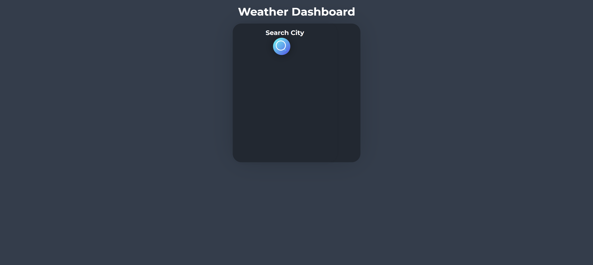
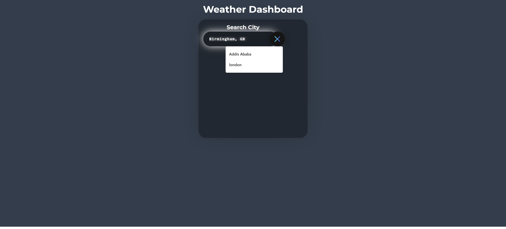
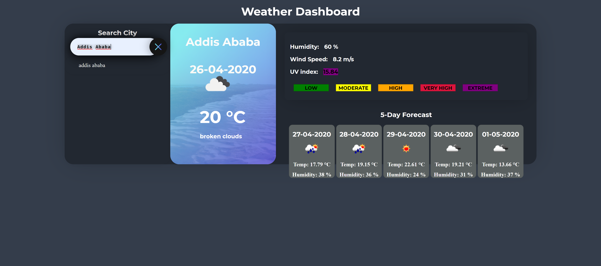
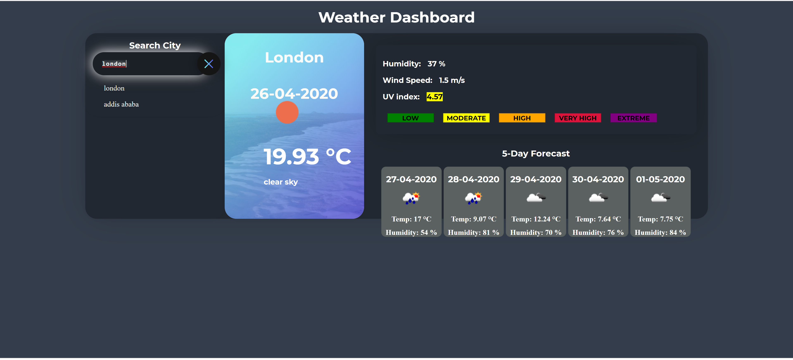
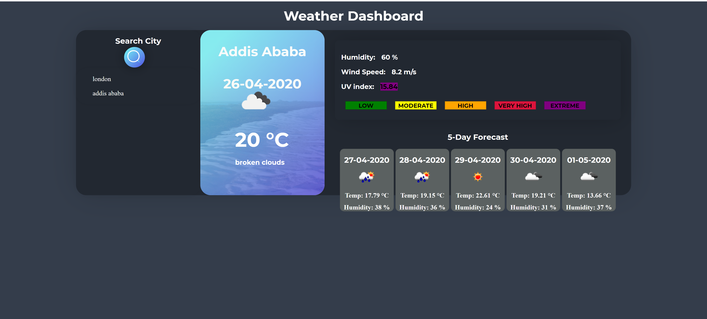
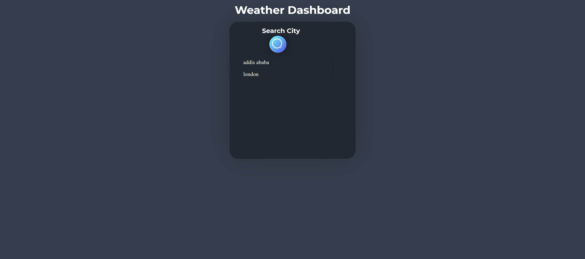

# Assignment-week-6

## Server-side API: Weather Dashboard

The application is a weather dashboard that uses the openweathermap api to acquire weather data for the current day as well as the five day forecast and presents them to the user in a user friendly format on the user interface.

Technologies used include HTML, CSS , Javascript, Jquery and Third Party APIs.

Upon Loading the user is presented with a search icon that reveals an input area when clicked. If the user has previous searches saved in local storage then the user is also presented with a list of the 8 most recent searches, which the user can click to get the weather data for the selected city. The user can also type in a new city into the search input and upon hitting enter key the data is presented. 

The divs that hold the current data and forecast are hidden until a city is searched or clicked and appear after. This gives the application a cleaner look. 

### Data Outputs
the application provides the user with the following:

 * Search History
 * Current Weather forecast with the city, date, weather icon, word description of the forecast, temperature, humidity, wind speed and UV index (The UV index is color coded and a scale is also presented to help the user identify the severity of the UV index).
  * Five day forecast with the date, weather icon, temperature and humidity

### APIs used to power Application
  [www.openweathermap.org]

  [https://api.openweathermap.org/data/2.5/weather?q={city-name}&appid={your-api-key}]

  [https://api.openweathermap.org/data/2.5/forecast?q={city-name}&appid={your-api-key}]

  [https://api.openweathermap.org/data/2.5/uvi?appid={appid}&lat={lat}&lon={lon}]

The inspiration for the css styling was taken from a codepen by Colin Espinas:
[https://codepen.io/Call_in/pen/pMYGbZ]

### Links:

__github repository link__
https://github.com/meeday/Assignment-week-6

__Deployed Application Link__
https://meeday.github.io/Assignment-week-6/index.html

__IMAGES__

